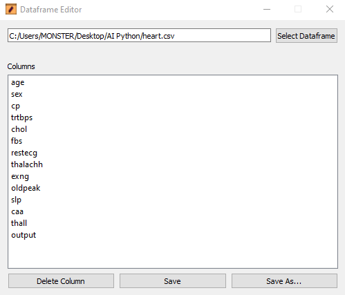

# Python-Dataframe-Editor
Very simple application for delete columns in a dataframe. 

# Requirements

You need to install some modules:
 
`pip install pyqt5`
 
`pip install pyqt5-tools`
 
`pip install openpyxl`
 
# Program

